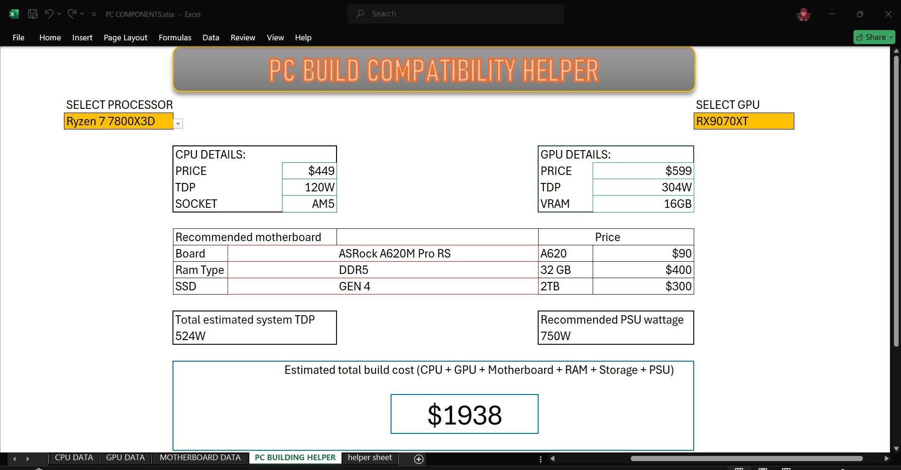

# PC Build Compatibility Helper

An interactive Excel dashboard that helps users select a compatible CPU and GPU, 
then automatically recommends a matching motherboard, RAM type, PSU wattage, 
and total estimated build cost.

## Preview

## Features
- Dropdown selection for 60+ AMD processors (AM4 & AM5) and 90+ GPUs (Nvidia & AMD)
- Auto-populated CPU/GPU specs: price, TDP, socket, VRAM
- Motherboard recommendation based on socket compatibility and CPU price tier
- Dynamic RAM and SSD recommendations (16GB/1TB vs 32GB/2TB) based on total build cost
- Automatic PSU wattage recommendation based on combined system TDP
- Live total build cost calculator

## Tools & Skills Used
- Microsoft Excel (XLOOKUP, nested IF, SUBSTITUTE, Data Validation, named ranges)
- Relational data modeling across multiple linked sheets
- Dashboard UI design

## How to Use
1. Download `PC_Build_Helper.xlsx`
2. Select a processor and GPU from the dropdown menus
3. View auto-generated compatibility and cost recommendations

## Data Sources
CPU/GPU specs and launch pricing compiled from manufacturer data (AMD, Nvidia) as of mid-2026.
